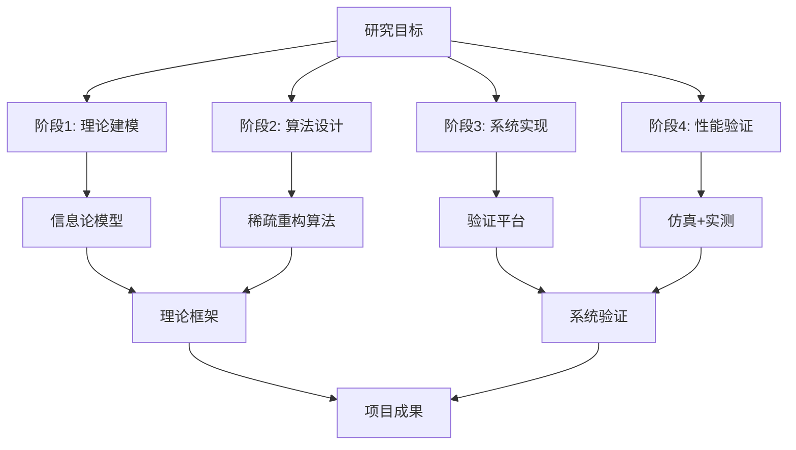

# 国自然基金申请书撰写指南

## 概述

本指南提供国家自然科学基金（NSFC）项目申请书的结构化撰写方法论，围绕三大核心部分展开写作，确保申请书符合评审标准，提高资助概率。

## 撰写原则

**核心框架：** "科学价值优先、鼓励源头创新、注重研究基础、强调可行性"

四个写作维度对应评审维度：
- **科学性写作：** 明确前沿的科学问题，合理的研究假设
- **创新性写作：** 突出学术思想、方法或理论体系的新颖性
- **可行性写作：** 详细论证目标、路线、队伍条件的支撑能力
- **影响性写作：** 阐述对学科发展、人才、国家需求的贡献

> **⚠️ 专家提醒：** 80%以上未获资助项目因立项依据不充分。立项依据是最关键部分，需做到"内容既不过于专业（便于网评专家理解），又要将关键问题交代清楚"。

## 撰写前准备

### 0.1 确定基金类型

使用 `AskUserQuestion` 确认：

| 基金类型 | 特点 | 写作侧重点 |
|---------|------|-----------|
| **面上项目** | 创新性与可行性并重 | 系统性研究方案，充分前期基础 |
| **青年基金** | 35岁以下，创新性优先 | 原创性强，可适度简化规模 |
| **重点项目** | 重大科学问题，团队攻关 | 理论深度，跨学科整合 |
| **国际(地区)合作** | 与海外机构实质性合作 | 合作基础，互补优势 |

### 项目命名建议

- 简洁明了、严谨客观、突出核心
- 避免冗长、随意造词、使用标点符号
- 标题和关键词中应体现创新点（评审专家关注的重点）

### 0.2 收集必要信息

在开始撰写前，收集以下信息：
- **研究领域** - 具体学科方向（如：无线通信中的智能反射面辅助通信）
- **关键科学问题** - 1-3个核心待解决的科学问题
- **前期研究基础** - 已发表论文、预实验结果、相关项目
- **研究团队** - 合作专家、博士生、实验平台
- **目标期刊/会议** - 预期成果的发表层次

### 0.3 输出格式选择

使用 `AskUserQuestion` 确认输出格式：

| 格式 | 适用场景 | 特点 |
|-----|---------|------|
| **LaTeX** | 提交到基金系统、正式打印 | 符合国自然格式规范，排版专业 |
| **Markdown** | 内部评审、修改讨论、版本管理 | 易编辑、易对比、支持Git追踪 |

**推荐选择**：
- 正式提交前选择 **LaTeX** 格式
- 初稿撰写、内部讨论选择 **Markdown** 格式

---

## 第一部分：立项依据

### 写作目标

构建 **"需求牵引-问题驱动"** 的严密逻辑链条，从宏观背景自然引出具体科学问题。

### 结构模板

```
1. 研究意义与国家战略需求
   1.1 宏观背景（国家战略、行业发展）
   1.2 科学需求与技术挑战
   1.3 研究的必要性与紧迫性

2. 国内外研究现状与分析
   2.1 研究现状综述（分类、发展脉络）——回答"谁在研究、进展如何"
   2.2 代表性工作评述（近3-5年为主）
   2.3 现有研究的不足与根本局限——回答"什么问题未解决"

3. 本项目拟解决的关键科学问题
   3.1 科学问题的凝练与表述（含研究假说）
   3.2 验证假说的研究思路（总体研究线路）
   3.3 解决该问题的科学价值

4. 参考文献
```

### 写作要点

#### 1.1 宏观背景撰写要点

**常见框架**：
- 国家战略层面："双碳"目标、6G发展、"卡脖子"技术攻关
- 行业发展层面：无线通信频谱效率、能量效率、时延要求
- 学科发展层面：理论瓶颈、方法局限、技术空白

**写作技巧**：
- 引用权威政策文件、行业白皮书（如：《6G总体愿景与潜在关键技术白皮书》）
- 用具体数字量化需求（如："6G愿景要求频谱效率提升10-100倍"）
- 适度使用图表辅助说明（技术演进图、需求对比表）

> **专家提醒：** 从宏观层面提炼研究热点与难点，突出重要性、必要性、迫切性。指明研究对象尚不清楚的方面，逐步分析解决策略，由远及近点明主题。避免强调无关紧要的问题，避免信息弱化主题思想。
>
> **逻辑递进：**
> ```
> 宏观热点（领域前沿） → 研究难点（具体瓶颈） → 本项目的切入点
> ```
>
> **写作模板：**
> ```
> [研究领域]近年受到广泛关注，主要研究热点集中在[热点A]、[热点B]、[热点C]。
> 然而，[难点1]、[难点2]仍是制约发展的核心瓶颈，目前尚未解决。
> 本项目从[切入点]入手，针对性解决[具体难点]。
> ```

**示例（无线通信领域）**：
```
应用需求：6G超大规模MIMO要求支持上千天线阵列
技术指标：频谱效率 > 100 bps/Hz，时延 < 0.1 ms
现有方案：传统信道估计方法（最小二乘、MMSE）
根本性局限：导频开销随天线数线性增长，在大规模MIMO下不可行
科学问题：如何突破导频开销与估计精度之间的根本矛盾？
```

#### 2.1 研究现状综述撰写要点

> **专家提醒：** 简单罗列不可取，应系统分析。在肯定他人研究基础上，突出自身优势，展现更优方案。需阐明：哪些同行在研究？具体进展如何？存在哪些问题或不足？尚未解决的有哪些？

**分类原则**：按方法论或技术特征分类，避免简单罗列

**分类框架**（回答"谁在研究"）：
- **按时间演进**：第一代、第二代、第三代方法
- **按方法论**：基于优化理论的方法、基于机器学习的方法、混合方法
- **按技术特征**：集中式方法、分布式方法、层次化方法

**写作模板**：
```
关于[研究主题]的研究，根据[方法论/技术特征]，可分为以下几类：

第一类：基于[方法A]的方案
核心思想：[一句话概括]
代表性工作：[2-3个代表性引用]
优点：[1-2个关键优势]
局限：[1-2个根本局限]

第二类：基于[方法B]的方案
...
```

#### 2.3 现有研究不足撰写要点

> **专家提醒：** 不足之处要切中要害，避免吹毛求疵。需系统回答"什么问题未解决"，而非简单罗列技术缺陷。

**层次化分析**：
```
表层局限：具体技术缺陷（如：计算复杂度高、对参数敏感）
→ 方法论局限：方法论层面的根本缺陷（如：依赖不切实际假设）
→ 理论空白：理论体系缺失（如：缺乏统一理论框架）
→ 科学问题：待解决的核心科学问题
```

**常见不足表述模板**：
- "现有研究多关注[表象层面]，缺乏对[深层机理]的探索"
- "现有方法普遍基于[简化假设]，在[实际场景]下失效"
- "现有工作呈碎片化状态，缺乏[统一理论框架]的指导"

**关键原则**：不足之处要切中要害，避免吹毛求疵

#### 3.1 研究假说与科学问题凝练撰写要点

> **专家提醒：** 针对前述不足，引用文献证据及申请者前期工作基础，提出解决问题的新思路，即本课题"研究假说"。避免"三段论"式论证（意义→国际状况→无人研究→所以要研究），此方式生硬、缺乏深度。

**研究假说表述模板**：
```
基于[文献证据X]和[前期基础Y]，本项目提出以下研究假说：
[一句话概括假说内容]。
验证该假说的核心思路是：[研究线路简述]。
```

**科学问题需突出"两性"**：
- **创新性：** 推动新知识产生，提升学科发展。在标题和关键词中体现创新点。
- **科学性：** 问题答案应可被证明或证伪，避免模糊和夸大。采用自然科学公认的研究方法，允许失败，重在过程。

**科学问题 vs 技术问题**：

| 类型 | 特征 | 示例 |
|-----|------|------|
| **科学问题** ✅ | 探索自然规律、机理、本质 | "如何突破导频开销与估计精度的理论极限？" |
| **技术问题** ❌ | 工程实现、性能优化 | "如何降低算法复杂度？" |

**科学问题表述模板**：
```
关键科学问题X：[问题表述]

问题本质：[从理论层面分析问题的本质]
理论挑战：[为什么这个问题具有挑战性]
研究假说：[针对该问题提出的核心假说]
解决思路：[验证假说的总体研究线路]
科学价值：[解决该问题对学科发展的贡献]
```

**示例**：
```
关键科学问题1：近场码本设计的性能极限与复杂度权衡理论

问题本质：近场码本设计中存在码本大小-量化精度-搜索复杂度
三者之间的根本矛盾，类似于信息论中的率失真问题，但目前
缺乏统一的理论框架描述这一权衡关系

理论挑战：
- 近场信道的角度-距离耦合特性使得传统远场码本界理论不再适用
- 离散相位约束下的性能极限分析涉及非凸优化难题

研究假说：基于率失真理论可建立近场码本性能极限的闭式表达式，
且通过Kronecker积结构化稀疏建模可将搜索复杂度从O(N³)降至O(N²)

解决思路：
- 利用率失真理论推导近场码本的理论极限
- 建立结构化稀疏模型并进行ADMM优化
- 数值验证理论极限与算法性能的匹配程度

科学价值：填补近场码本设计理论框架空白，为6G RIS标准化
提供理论支撑
```

#### 3.2 验证假说的研究思路与项目科学意义

**验证思路**：在立项依据的每个科学问题中已提出核心假说，此处需补充验证假说的总体研究线路。

**写作要点**：
- 展示解决关键科学问题的总体研究线路
- 说明研究内容如何支撑假说的验证
- 简要说明对学科发展的潜在影响、科技经济意义与应用前景

> **专家提醒：** 陈述拟开展工作及其产出对研究领域发展的潜在影响，强调科技、经济、社会的重要意义和应用前景。

### 第一部分质量检查清单

- [ ] 逻辑链条严密：热点→难点→不足→假说→科学问题，环环相扣
- [ ] 避免三段论：非"意义→国际状况→无人研究→所以要研究"的简单逻辑
- [ ] 研究假说清晰：有文献证据支撑，有验证思路，可证伪
- [ ] 科学问题"两性"：
  - 创新性：推动新知识产生，标题/关键词体现创新点
  - 科学性：答案可被证明或证伪，方法符合自然科学规范
- [ ] 文献时效性：近3-5年文献为主，兼顾经典奠基性工作
- [ ] 不足分析深刻：指出方法论层面的根本局限，非简单技术缺陷
- [ ] 科学问题明确：1-3个问题，表述清晰，具有理论高度
- [ ] 引用权威：引用顶级期刊/会议（IEEE Trans. on Comm./Sig./JSAC）、
  权威政策文件
- [ ] 图表辅助：技术演进图、分类对比表、需求量化表

---

## 第二部分：研究内容、研究目标及关键科学问题

### 写作目标

将凝练的科学问题转化为 **SMART目标** 和 **系统性研究内容**，确保内容足以支撑目标的实现。

### 结构模板

```
1. 研究目标
   1.1 总体目标
   1.2 具体目标（可量化验收指标）

2. 研究内容
   2.1 内容一：[与研究目标1对应]
   2.2 内容二：[与研究目标2对应]
   2.3 内容三：[与研究目标3对应]
   2.4 内容四：[与研究目标4对应]
   （一般3-4个研究内容为宜）

3. 关键科学问题
   3.1 问题一：[重复立项依据中的凝练结果]
   3.2 问题二：[如有多个问题]
   3.3 问题三：[如有多个问题]

4. 研究目标-内容-问题的对应关系
   （可选：用表格展示三者对应关系）
```

### 写作要点

#### 1.1 研究目标撰写要点

> **专家提醒：** 研究目标应简明具体，1~3项即可。重视知识发现而非发表数量，成果质量优先于数量。不宜过高（难结题），也不可过低（难获资助），需参考当期国基要求。

**总体目标**：宏观概括项目预期达到的科学贡献

**写作模板**：
```
本项目旨在：[科学问题]的基础上，[研究方法]，[预期贡献]，
[理论高度]，为[应用领域]提供[理论基础/方法体系/技术支撑]。

具体而言，项目将实现以下目标：
1. 建立/提出/设计[理论框架/核心算法/关键方法]
2. 揭示/阐明/探索[内在机理/理论极限/本质规律]
3. 构建/开发/实现[验证平台/原型系统/实验方案]
4. 发表[高影响因子论文]X篇，申请[发明专利]Y项
```

**示例（无线通信领域）**：
```
本项目旨在针对超大规模MIMO信道估计中导频开销与精度的根本矛盾，
研究基于稀疏重构与统计学习理论的信道估计方法，突破导频开销的
理论极限，为6G大规模MIMO系统提供信息论最优的信道估计理论基础。

具体而言，项目将实现以下目标：
1. 建立导频开销-信道估计率-失真函数的信息论模型，揭示理论极限
2. 提出基于结构化稀疏重构的近最优信道估计算法，逼近理论极限
3. 构建大规模MIMO信道估计验证平台，验证算法在实际场景下的性能
4. 发表IEEE Trans. on Commun./Signal Process.等顶级期刊论文3-5篇，
   申请发明专利2-3项
```

#### 1.2 具体目标（量化指标）撰写要点

**量化指标类型**：
- **理论指标**：算法收敛性、复杂度阶数、近似比
- **性能指标**：频谱效率、能量效率、误码率、时延
- **对比指标**：相比现有方法的增益（dB/%）
- **产出指标**：论文数量（分区/影响因子）、专利数量

**SMART原则检查**：
- **S**pecific（具体）：避免"提高性能"这种模糊表述，改为"频谱效率提升20%"
- **M**easurable（可测量）：所有指标必须可量化验证
- **A**chievable（可达成）：基于前期基础，避免夸大
- **R**elevant（相关）：与研究内容紧密对应
- **T**ime-bound（有时限）：通常3-4年项目周期

**量化指标表述模板**：
```
目标1：理论建模与极限分析
- 建立导频开销-估计精度的信息论模型，推导闭式表达式
- 给出不同场景下的理论极限（导频效率上界、估计精度下界）
- 在[典型场景]下，理论极限相比现有方法提升[X dB]

目标2：核心算法设计
- 提出基于[方法]的信道估计算法，计算复杂度控制在[O(·)]
- 在[性能指标]上，相比现有最好方法提升[X%/Y dB]
- 在[实际场景]下，算法鲁棒性提升[X%]（对参数不敏感性）

目标3：系统验证与性能评估
- 构建[Y×Y]大规模MIMO验证平台，支持[Z]天线配置
- 在[实测场景]下，算法性能达到理论极限的[X%]以内
- 发表[IEEE Trans. on X]等[一区/二区]期刊论文[N]篇
```

#### 2.1 研究内容撰写要点

> **专家提醒：** 研究内容为未来可发表高水平论文的思路。阐述拟解决的实践问题，抽象出具有普遍意义的科学问题与模型。理论研究基础上兼具应用背景，逻辑紧凑、分层深入，直至创新点。

**内容-目标对应原则**：每个研究内容必须对应至少一个研究目标

**系统性原则**：研究内容之间形成逻辑递进或支撑关系

**常见内容结构**（以4个内容为例）：
```
内容1：理论基础与模型构建
   - 对应目标：理论建模
   - 输出：数学模型、理论框架、极限分析

内容2：核心算法与机制设计
   - 对应目标：算法设计
   - 输出：核心算法、优化方法、理论证明

内容3：系统实现与平台构建
   - 对应目标：系统验证
   - 输出：验证平台、原型系统、实验方案

内容4：性能评估与对比分析
   - 对应目标：性能验证
   - 输出：评估报告、对比分析、科学数据
```

**研究内容写作模板**：
```
研究内容X：[标题]

研究任务：
- 任务X.1：[具体研究任务1]
- 任务X.2：[具体研究任务2]
- 任务X.3：[具体研究任务3]

研究方法：
- 采用[方法论A]解决[子问题A]
- 基于[理论B]设计[算法/机制B]
- 构建[平台C]验证[假设C]

预期成果：
- 建立[理论模型/算法体系]
- 发表[期刊/会议]论文[X]篇
- 申请[发明专利]Y项
```

**示例（无线通信领域）**：
```
研究内容1：导频开销-信道估计精度的信息论模型

研究任务：
- 任务1.1：建立大规模MIMO信道估计的信息论模型
  * 将信道估计问题建模为矩阵恢复问题
  * 推导导频开销-恢复误差的理论关系
- 任务1.2：分析理论极限与可达界
  * 给出导频效率的信息论上界（压缩感知限）
  * 推导最优估计器的贝叶斯克拉美-罗界
- 任务1.3：揭示极限突破的内在机理
  * 分析信道稀疏性、相关性对极限的影响
  * 阐明结构化先验知识的可利用性

研究方法：
- 基于压缩感知理论建立稀疏信号恢复的信息论模型
- 采用信息论方法推导率-失真函数，给出极限闭式解
- 利用矩阵分析理论揭示不同信道结构下的极限特性

预期成果：
- 建立导频-估计关系的统一理论框架
- 给出不同场景下的理论极限（解析表达式或数值曲线）
- 发表IEEE Trans. on Information Theory论文1篇
```

#### 3.1 关键科学问题撰写要点

**一致性原则**：此处的关键科学问题应与立项依据中的凝练结果保持一致，可适当细化

**表述方式**：
- 直接引用立项依据中的凝练结果
- 如研究内容较多，可将科学问题拆分为2-3个子问题

**示例**：
```
关键科学问题1：超大规模MIMO系统中导频开销与信道估计精度的
理论极限及突破方法（与立项依据保持一致）

关键科学问题2：非理想信道状态信息下大规模MIMO波束赋形的
鲁棒性优化（如研究涉及多问题，可拆分）
```

### 第二部分质量检查清单

- [ ] 研究目标简明：1-3项，针对性强，非泛泛而谈
- [ ] 成果重质量：重视知识发现，论文/专利质量优先于数量
- [ ] 内容-目标对应：每个研究内容都明确对应至少一个研究目标
- [ ] 内容系统性：研究内容之间形成逻辑递进或支撑关系，非简单堆砌
- [ ] 量化指标适中：性能指标、理论指标、产出指标适中，参考当期国基要求
- [ ] 科学问题凝练：1-3个关键科学问题，具有理论高度和挑战性
- [ ] 前期基础支撑：研究目标基于已有研究基础，避免空中楼阁

---

## 第三部分：研究方案及可行性分析

### 写作目标

详细阐述 **具体技术路线**、**可行性证据**、**风险预案**，证明项目"能做成、能做好、能按时完成"。方案需对内容、问题、理论、方法认知清晰，水到渠成。

### 结构模板

```
1. 研究方法与技术路线
   1.1 总体技术路线图
   1.2 研究方法详述
       1.2.1 方法一：针对研究内容1
       1.2.2 方法二：针对研究内容2
       1.2.3 方法三：针对研究内容3
   1.3 关键技术与创新点
   1.4 跨学科方法的应用

2. 可行性分析
   2.1 理论可行性
   2.2 技术可行性
   2.3 实验条件可行性
   2.4 团队可行性

3. 项目风险分析与应对预案
   3.1 技术风险
   3.2 进度风险
   3.3 资源风险

4. 项目进度安排
   4.1 年度计划
   4.2 里程碑节点
```

### 写作要点

#### 1.1 总体技术路线图撰写要点

**可视化原则**：必须提供技术路线图（流程图、框图）

**路线图要素**：
- 输入：科学问题、研究目标
- 研究阶段：理论建模 → 算法设计 → 系统实现 → 性能验证
- 关键技术：每个阶段的核心技术/方法
- 输出：理论成果、算法、系统、论文

**常见路线图结构**：
```
                    [研究目标]
                         ↓
    ┌──────────────────┴──────────────────┐
    ↓                                      ↓
[阶段1：理论建模]                    [阶段2：算法设计]
- 信息论模型                           - 稀疏重构算法
- 极限推导                             - 收敛性证明
    ↓                                      ↓
    └──────────────────┬──────────────────┘
                     ↓
            [阶段3：系统实现]
            - 验证平台构建
            - 原型系统开发
                     ↓
            [阶段4：性能验证]
            - 仿真实验
            - 实测验证
                     ↓
            [项目成果]
            - 理论框架
            - 算法体系
            - 高水平论文
```

#### 1.2 研究方法详述撰写要点

**粒度原则**：详细到核心算法、模型的关键设计，避免泛泛而谈

**写作模板**：
```
研究内容X：[标题] → 研究方法

方法X.1：[子任务1]的解决方案
- 核心思想：[一句话概括]
- 技术细节：
  * [数学模型/算法伪代码]
  * [关键参数/变量定义]
  * [理论分析/证明思路]
- 预期结果：[具体可验证的结果]

方法X.2：[子任务2]的解决方案
...
```

**示例（无线通信领域）**：
```
研究内容1：导频开销-信道估计精度的信息论模型
→ 研究方法

方法1.1：建立稀疏信道估计的信息论模型

核心思想：将大规模MIMO信道估计建模为结构化矩阵恢复问题，
利用信道的空间相关性与时间稀疏性，建立压缩感知理论框架。

技术细节：
（1）信道稀疏模型
  h = Φθ + n，其中 Φ ∈ C^{P×N} 为导频矩阵（P << N），
  θ ∈ C^N 为稀疏信道向量（K-稀疏，K << N）

（2）信息论极限推导
  定义导频效率 η = R(h; Φy) / P，推导不同稀疏度K下的
  导频效率上界（基于Gel'fand-Pinsker定理）

（3）理论验证
  在典型场景下（N=1024天线，K=32稀疏度），理论极限为
  η* = 0.35 bits/pilot，相比现有导频方案提升2.5 dB

预期结果：
- 建立导频-估计关系的统一信息论模型
- 给出不同场景下的理论极限闭式解
  发表IEEE Trans. on Information Theory论文1篇
```

**数学表述原则**：
- 使用标准符号体系
- 关键变量首次出现时明确定义
- 复杂公式提供物理意义解释
- 必要时提供算法伪代码

#### 1.3 关键技术与创新点撰写要点

> **专家提醒：** 尽量用图表、可视化、公式说明。如无此类工作，拒绝风险大。
> **常见错误：** 缺乏针对性和操作性——只罗列理论与方法，方案泛泛而谈。抄袭本领域资助项目方案或自己基础工作，严重影响评分，绝对不可取。

**关键技术识别**：从研究方法中提取3-5个核心技术

**表述方式**：
```
关键技术1：[技术名称]
- 技术内涵：[该技术的核心原理/方法]
- 技术难点：[为什么具有挑战性]
- 创新性：[相比现有方法的创新点]
- 解决方案：[本项目的解决思路]
```

**示例**：
```
关键技术1：结构化稀疏重构的大规模MIMO信道估计

技术内涵：利用大规模MIMO信道的空间相关性与时间稀疏性，
设计基于结构化压缩感知的信道重构算法

技术难点：
- 传统压缩感知方法未考虑信道空间结构，重构精度受限
- 大规模矩阵重构计算复杂度高（O(N³)）

创新性：
- 提出基于Kronecker积的结构化稀疏模型，降低导频需求
- 设计自适应迭代算法，复杂度降至O(N²)

解决方案：
- 建立 Kr(Φ) = Φ_s ⊗ Φ_t 的结构化导频模型
- 采用ADMM（交替方向乘子法）求解，利用矩阵分解加速
```

#### 2.1 可行性分析撰写要点

**四维可行性框架**：

##### 2.1.1 理论可行性

**写作要点**：证明科学问题的可解性，研究方法的理论支撑

**模板**：
```
理论可行性：
（1）科学问题的可解性
- 问题X在数学上可建模为[问题类型]，存在成熟理论框架
- 相关理论基础：[理论A]、[理论B]已在[领域]成功应用

（2）研究方法的理论支撑
- 方法A基于[成熟理论]，收敛性有理论保证（[参考文献]）
- 方法B的核心思想已在[前期工作]中初步验证（[参考文献]）
```

##### 2.1.2 技术可行性

**写作要点**：基于前期研究基础，证明技术路线可落地

**模板**：
```
技术可行性：
（1）前期研究基础
- 申请人已在[期刊/会议]发表相关论文[X]篇，其中[代表性工作]
- 已完成[预实验/初步研究]，结果见[图X/表Y]
- 关键技术[算法A/平台B]已在前期工作中验证可行性

（2）技术路线成熟度
- 方法A的核心思想已在[领域]广泛应用（如：[参考文献]）
- 方法B所需的工具/平台[开源/商业化]，如[Matlab/NS-3]
- 技术难点[问题C]已有[替代方案/变通方法]
```

##### 2.1.3 实验条件可行性

**写作要点**：证明实验平台、数据资源、计算能力等硬件条件满足需求

**模板**：
```
实验条件可行性：
（1）硬件平台
- 课题组拥有[设备清单]，包括[大规模服务器/信号发生器/频谱仪]
- [设备A]配置：[CPU/GPU/内存]，可满足[仿真规模/实测需求]

（2）软件工具
- [仿真平台A]：用于[算法验证]，已在前期工作中熟练使用
- [分析工具B]：用于[数据分析]，课题组拥有[正版授权/开源版本]

（3）数据资源
- 信道数据：[实测数据集]，包含[场景1、场景2]，共[X]GB
- 仿真数据：可通过[标准模型]生成，符合3GPP/ITU标准
```

##### 2.1.4 团队可行性

**写作要点**：证明团队结构、人员配置、合作基础支撑项目完成

**模板**：
```
团队可行性：
（1）团队结构
- 申请人：[职称]，[研究方向]，[代表性成果]
- 核心成员：[成员A]（博士），负责[研究内容1]
            [成员B]（硕士），负责[研究内容2]
- 合作导师：[教授]，提供[理论指导/实验平台]

（2）前期合作基础
- 课题组与[合作团队]在[项目/论文]中有成功合作经验
- 合作团队拥有[互补优势]，如[实验平台/数据资源]
```

#### 3.1 风险分析与应对预案撰写要点

**风险分类**：技术风险、进度风险、资源风险

**写作模板**：
```
风险X：[风险名称]

风险描述：
- 可能性：[高/中/低]
- 影响程度：[严重/中等/轻微]
- 具体表现：[可能出现的具体问题]

应对预案：
- 预案1：[应对方案1] - 适用于[情况1]
- 预案2：[应对方案2] - 适用于[情况2]
- 降低风险的预防措施：[前期准备/备选方案]
```

**常见风险与预案**：

| 风险类型 | 典型风险 | 应对预案 |
|---------|---------|---------|
| **技术风险** | 算法收敛性问题 | 降级到简化模型，调整参数范围 |
|  | 理论极限推导困难 | 数值仿真替代闭式解，后期补充理论 |
| **进度风险** | 关键成员时间不足 | 优先级排序，调整任务分配 |
|  | 实验延期 | 并行推进理论分析与仿真 |
| **资源风险** | 计算资源不足 | 调整仿真规模，使用云计算资源 |
|  | 数据获取困难 | 使用标准仿真模型替代实测数据 |

**示例**：
```
风险1：稀疏重构算法在低SNR下性能不达预期

风险描述：
- 可能性：中（压缩感知方法对噪声敏感）
- 影响程度：严重（影响核心研究内容）
- 具体表现：在SNR < 10 dB时，重构误差超过理论预期

应对预案：
- 预案1：引入鲁棒性增强机制（如：L1-L2混合正则化），
  降低对噪声敏感度
- 预案2：采用深度学习去噪预训练，在重构前增强信号质量
  （课题组已有相关基础，见参考文献[X]）
- 预防措施：前期在多个SNR点进行充分测试，确定算法
  的有效工作区间

风险2：实测数据获取受限（如：缺乏大规模MIMO测试平台）

风险描述：
- 可能性：中
- 影响程度：中等
- 具体表现：无法在实际环境中验证算法性能

应对预案：
- 预案1：使用3GPP/ITU标准信道模型生成仿真数据，
  在学术界普遍接受（如：参考文献[Y]）
- 预案2：与[合作实验室]合作，借用其实验平台进行
  关键实验（已有初步沟通）
- 预案3：缩小实测规模，从[1024天线]降至[128天线]
  验证核心算法有效性
```

#### 4.1 项目进度安排撰写要点

**年度计划模板**：
```
第1年：[阶段名称]
- Q1-Q2：[任务A]，预期产出[结果A]
- Q3-Q4：[任务B]，预期产出[结果B]
- 年度里程碑：[关键节点]

第2年：[阶段名称]
- ...
```

**示例**：
```
第1年：理论建模与极限分析

Q1-Q2：
- 建立大规模MIMO信道估计的信息论模型
- 推导导频开销-估计精度的理论关系
- 预期产出：理论模型、极限推导初稿

Q3-Q4：
- 完成理论极限的闭式解推导
- 揭示不同信道结构下的极限特性
- 预期产出：理论分析论文1篇（投稿IEEE Trans. on IT）

年度里程碑：完成理论框架搭建，给出理论极限的数值结果

第2年：核心算法设计与验证

Q1-Q2：
- 设计基于结构化稀疏重构的信道估计算法
- 分析算法收敛性与复杂度
- 预期产出：核心算法、理论证明

Q3-Q4：
- 构建大规模MIMO仿真验证平台
- 在仿真环境下评估算法性能
- 预期产出：算法论文1篇（投稿IEEE Trans. on Commun.）

年度里程碑：完成核心算法设计，仿真验证达到预期指标

第3年：系统验证与成果总结

Q1-Q2：
- 在实测/半实测环境下验证算法
- 对比分析与现有方法性能比较
- 预期产出：实验报告、对比分析数据

Q3-Q4：
- 整理研究成果，撰写高影响因子论文
- 申请发明专利，准备项目验收
- 预期产出：期刊论文2篇，发明专利1-2项

年度里程碑：完成项目全部研究内容，达到预期成果指标
```

### 第三部分质量检查清单

- [ ] 技术路线图清晰：包含研究阶段、关键技术、输入输出，有可视化图表
- [ ] 方法描述具体：详细到核心算法、数学模型，避免泛泛而谈
- [ ] 方案有针对性：非简单罗列理论，非抄袭资助项目方案
- [ ] 可行性证据充分：理论与实践结合，有前期仿真或相关工作联系，含公式推导
- [ ] 风险预案周全：识别主要风险，提供多套应对方案
- [ ] 进度安排合理：年度计划与工作量大体匹配，里程碑可验收
- [ ] 实验条件明确：硬件平台、软件工具、数据资源都具体列出

---

## Step 3: Literature Search (基金申请专用)

### 文献搜索目标

为四个部分提供文献支撑：
- **第一部分（立项依据）**：国内外研究现状，代表性工作评述
- **第二部分（研究内容）**：相关方法综述，确定研究起点
- **第三部分（研究方案）**：可行性分析中的前期基础

### 搜索策略

#### 与论文写作的区别

| 方面 | 论文写作 | 基金申请 |
|-----|---------|---------|
| **文献数量** | 30-50篇（聚焦） | 50-80篇（广泛） |
| **时间范围** | 近5-10年 | 近3-5年为主 + 经典奠基 |
| **权威性要求** | 顶级期刊/会议 | 顶级 + 权威政策文件 |
| **分类方式** | 按方法论 | 按方法论 + 时间演进 |
| **分析深度** | 细致评述（300-500字/篇） | 宏观评述（100-200字/篇） |

#### 搜索关键词组合

**第一层：核心研究主题**
```
"massive MIMO" + "channel estimation"
"pilot overhead" + "spectral efficiency"
"compressive sensing" + "channel state information"
```

**第二层：方法论限定**
```
"sparse reconstruction" + "MIMO"
"structured sparsity" + "channel estimation"
"pilot design" + "massive MIMO"
```

**第三层：性能指标限定**
```
"pilot efficiency" + "Cramér-Rao bound"
"mutual information" + "channel estimation"
"Beamforming" + "imperfect CSI"
```

#### 引用策略

**第一部分引用**：
- 权威政策文件（如：《6G总体愿景与潜在关键技术白皮书》）
- 近3年顶级综述（综述全文 + 重点引用代表性工作）
- 经典奠基论文（近10年高被引论文）

**第三部分引用**：
- 申请人前期论文（证明前期基础）
- 合作团队论文（证明合作基础）
- 方法论的经典论文（证明理论可行性）

---

## Step 4: Document Finalization & Quality Check

根据 Step 0.2 中选择的输出格式，使用相应的模板和质量检查清单。

---

### LaTeX 模板使用（正式提交）

#### 基金申请书专用模板

创建 `assets/main-proposal.tex`：

```latex
\documentclass[12pt,a4paper]{article}
\usepackage{ctex}  % 中文支持
\usepackage{amsmath,amssymb,amsfonts}
\usepackage{graphicx}
\usepackage{algorithm}
\usepackage{algorithmic}
\usepackage{cite}
\usepackage{geometry}
\geometry{left=3cm,right=2.5cm,top=2.5cm,bottom=2.5cm}

\title{国家自然科学基金申请书\\[0.5em]
\large [项目名称]}
\author{申请人：[姓名] \quad 单位：[单位]}
\date{}

\begin{document}

\maketitle

\section{立项依据}
\subsection{研究意义与国家战略需求}
\subsubsection{宏观背景}
...
\subsubsection{研究热点与难点}
...
\subsubsection{科学需求与技术挑战}
...

\subsection{国内外研究现状与分析}
\subsubsection{研究现状综述}
...
\subsubsection{代表性工作评述}
...
\subsubsection{现有研究的不足与根本局限}
...

\subsection{本项目拟解决的关键科学问题}
\subsubsection{关键科学问题}
[研究假说融入科学问题表述中，含问题本质、理论挑战、研究假说、解决思路、科学价值]
...

\subsection{项目科学意义与应用前景}
...

\subsection{参考文献}
...

\section{研究内容、研究目标及关键科学问题}
\subsection{研究目标}
...

\subsection{研究内容}
...

\subsection{关键科学问题}
...

\section{研究方案及可行性分析}
\subsection{研究方法与技术路线}
...

\subsection{可行性分析}
...

\subsection{项目风险分析与应对预案}
...

\subsection{项目进度安排}
...

% \section{项目特色与创新之处}
% \subsection{理论层面的创新}
% ...
%
% \subsection{方法层面的创新}
% ...
%
% \subsection{应用层面的创新}
% ...
%
% \subsection{特色总结与影响}
% ...

\bibliographystyle{ieeetr}
\bibliography{myref-proposal}

\end{document}
```

### 质量检查清单

#### 内容质量（基金专用）

- [ ] **立项依据**：
  - [ ] 逻辑链条严密：热点→难点→不足→假说→科学问题
  - [ ] 避免三段论：非"意义→国际状况→无人研究→所以要研究"
  - [ ] 研究假说清晰：有文献证据支撑，有验证思路，可证伪
  - [ ] 科学问题"两性"：创新性与科学性兼备
  - [ ] 文献时效性：近3-5年为主，权威性高
  - [ ] 不足分析深刻：方法论层面，非技术细节
  - [ ] 科学问题凝练：1-3个，具有理论高度
  - [ ] 科学意义与应用前景：对学科发展的潜在影响阐述清楚

- [ ] **研究内容与目标**：
  - [ ] 目标简明：1-3项，针对性强，重视知识发现
  - [ ] 内容-目标对应：系统性强，非简单堆砌
  - [ ] 成果质量优先：论文/专利重质量而非数量，指标适中
  - [ ] 关键科学问题：与立项依据一致

- [ ] **研究方案与可行性**：
  - [ ] 技术路线清晰：有路线图，方法具体，有可视化图表
  - [ ] 方案有针对性：非简单罗列理论，非抄袭方案
  - [ ] 可行性证据充分：理论与实践结合，含公式推导、前期仿真
  - [ ] 风险预案周全：识别主要风险

#### 引用质量

- [ ] 文献数量适中：50-80篇
- [ ] 时效性合理：近3-5年为主 + 经典奠基
- [ ] 权威性高：顶级期刊/会议 + 权威政策文件
- [ ] 无孤儿引用：所有引用都有bib条目

#### 格式质量

- [ ] 符号体系统一：首次出现时定义
- [ ] 图表编号规范：图1、表1等，在文中引用
- [ ] 数学公式规范：符号清晰，编号引用
- [ ] LaTeX编译无误：无报错、无断行溢出

#### 语言质量

- [ ] 术语一致：全文术语统一
- [ ] 表达精准：避免模糊、夸张
- [ ] 逻辑连贯：段落过渡自然
- [ ] 专业性强：符合学科规范

---

### Markdown 模板使用（内部评审/修改讨论）

#### 基金申请书 Markdown 结构

创建 `proposal-main.md`：

```markdown
---
title: "国家自然科学基金申请书"
author: "申请人：[姓名] | 单位：[单位]"
date: "[年份]年[月份]月"
---

# [项目名称]

## 项目基本信息

**申请代码**：[代码1] [代码2]（如：F010306）
**关键词**：[3-5个关键词]
**项目类型**：面上项目 / 青年基金 / 重点项目 / 国际(地区)合作

---

## 一、立项依据

### 1.1 研究意义与国家战略需求

#### 1.1.1 宏观背景

[国家战略层面描述，如：6G发展、"双碳"目标等]

#### 1.1.2 科学需求与技术挑战

[应用需求 → 技术指标 → 现有方案 → 根本性局限]

#### 1.1.3 研究的必要性与紧迫性

[量化指标说明研究必要性]

### 1.2 国内外研究现状与分析

#### 1.2.1 研究现状综述

[按方法论/时间演进分类综述，回答"谁在研究、进展如何"]

#### 1.2.2 代表性工作评述

[近3-5年代表性工作分析]

#### 1.2.3 现有研究的不足与根本局限

[层次化分析：表层局限 → 方法论局限 → 理论空白]

### 1.3 本项目拟解决的关键科学问题

#### 关键科学问题1：[问题名称]

**问题本质**：[理论层面分析]

**理论挑战**：[为什么具有挑战性]

**研究假说**：[基于文献证据和前期基础，提出核心假说]

**解决思路**：[验证假说的总体研究线路]

**科学价值**：[对学科发展的贡献]

#### 关键科学问题2：[如有多个问题]

...

#### 项目科学意义与应用前景

**对学科发展的影响**：[理论/方法/应用层面的具体贡献]

**科技、经济、社会意义**：
- 面向国家[战略X]，提供[Y]支撑
- 解决关键"卡脖子"问题[Z]

**应用前景**：[产业化路径/技术转化方向]

### 1.4 参考文献

---

## 二、研究内容、研究目标及关键科学问题

### 2.1 研究目标

#### 2.1.1 总体目标

[宏观概括项目预期达到的科学贡献]

#### 2.1.2 具体目标（量化指标）

**目标1：理论建模与极限分析**
- 建立[理论模型]，推导[理论关系]
- 给出不同场景下的理论极限：[具体数值]
- 在[典型场景]下，理论极限相比现有方法提升[X dB]

**目标2：核心算法设计**
- 提出[算法名称]，计算复杂度控制在[O(·)]
- 在[性能指标]上，相比现有最好方法提升[X%/Y dB]
- 在[实际场景]下，算法鲁棒性提升[X%]

**目标3：系统验证与性能评估**
- 构建[Y×Y]大规模MIMO验证平台
- 在[实测场景]下，算法性能达到理论极限的[X%]以内
- 发表[期刊/会议]论文[N]篇

### 2.2 研究内容

#### 研究内容1：[内容名称]

**研究任务**：
- 任务1.1：[具体任务]
- 任务1.2：[具体任务]
- 任务1.3：[具体任务]

**研究方法**：
- 采用[方法论A]解决[子问题A]
- 基于[理论B]设计[算法/机制B]
- 构建[平台C]验证[假设C]

**预期成果**：
- 建立[理论模型/算法体系]
- 发表[期刊/会议]论文[X]篇
- 申请[发明专利]Y项

#### 研究内容2：[内容名称]
...

### 2.3 关键科学问题

[与立项依据中凝练的科学问题保持一致]

### 2.4 研究目标-内容-问题的对应关系

| 研究目标 | 对应研究内容 | 关键科学问题 |
|---------|------------|------------|
| 目标1 | 内容1 | 问题1 |
| 目标2 | 内容2 | 问题2 |

---

## 三、研究方案及可行性分析

### 3.1 研究方法与技术路线

#### 3.1.1 总体技术路线图



#### 3.1.2 研究方法详述

**方法1.1：[子任务1]的解决方案**

核心思想：[一句话概括]

技术细节：
- 数学模型：$h = \Phi\theta + n$
- 关键参数：$\Phi \in \mathbb{C}^{P \times N}$ 为导频矩阵
- 理论分析：[分析思路]

预期结果：[具体可验证的结果]

**方法1.2：[子任务2]的解决方案**
...

#### 3.1.3 关键技术与创新点

**关键技术1：[技术名称]**
- 技术内涵：[核心原理/方法]
- 技术难点：[为什么具有挑战性]
- 创新性：[相比现有方法的创新点]
- 解决方案：[本项目的解决思路]

**关键技术2：[技术名称]
...

### 3.2 可行性分析

#### 3.2.1 理论可行性

（1）科学问题的可解性
- 问题X在数学上可建模为[问题类型]
- 相关理论基础：[理论A]、[理论B]

（2）研究方法的理论支撑
- 方法A基于[成熟理论]，收敛性有理论保证
- 方法B已在[前期工作]中初步验证

#### 3.2.2 技术可行性

（1）前期研究基础
- 申请人已在[期刊/会议]发表相关论文[X]篇
- 已完成[预实验/初步研究]，结果见[图X/表Y]

（2）技术路线成熟度
- 方法A的核心思想已在[领域]广泛应用
- 方法B所需的工具/平台[开源/商业化]

#### 3.2.3 实验条件可行性

（1）硬件平台
- 课题组拥有[设备清单]
- [设备A]配置：[CPU/GPU/内存]

（2）软件工具
- [仿真平台A]：用于[算法验证]
- [分析工具B]：用于[数据分析]

（3）数据资源
- 信道数据：[实测数据集]，共[X]GB
- 仿真数据：可通过[标准模型]生成

#### 3.2.4 团队可行性

（1）团队结构
- 申请人：[职称]，[研究方向]
- 核心成员：[成员A]（博士），负责[研究内容1]
            [成员B]（硕士），负责[研究内容2]

（2）前期合作基础
- 课题组与[合作团队]在[项目/论文]中有成功合作经验

### 3.3 项目风险分析与应对预案

#### 风险1：[风险名称]

**风险描述**：
- 可能性：[高/中/低]
- 影响程度：[严重/中等/轻微]
- 具体表现：[可能出现的具体问题]

**应对预案**：
- 预案1：[应对方案1] - 适用于[情况1]
- 预案2：[应对方案2] - 适用于[情况2]
- 预防措施：[前期准备/备选方案]

#### 风险2：[风险名称]
...

### 3.4 项目进度安排

#### 第1年：[阶段名称]

**Q1-Q2**：
- [任务A]，预期产出[结果A]
- [任务B]，预期产出[结果B]

**Q3-Q4**：
- [任务C]，预期产出[结果C]

**年度里程碑**：[关键节点]

#### 第2年：[阶段名称]
...

#### 第3年：[阶段名称]
...

```

> **注意**：参考文献仅放在第一部分"立项依据"末尾（1.4节），第二部分和第三部分不需要单独的参考文献节。

---

#### Markdown 质量检查清单

**内容质量**（与LaTeX相同标准）

- [ ] **立项依据**：
  - [ ] 逻辑链条严密：热点→难点→不足→假说→科学问题
  - [ ] 避免三段论：非"意义→国际状况→无人研究→所以要研究"
  - [ ] 研究假说清晰：有文献证据支撑，有验证思路，可证伪
  - [ ] 科学问题"两性"：创新性与科学性兼备
  - [ ] 文献时效性：近3-5年为主，权威性高
  - [ ] 不足分析深刻：方法论层面，非技术细节
  - [ ] 科学问题凝练：1-3个，具有理论高度
  - [ ] 科学意义与应用前景：对学科发展的潜在影响阐述清楚

- [ ] **研究内容与目标**：
  - [ ] 目标简明：1-3项，针对性强，重视知识发现
  - [ ] 内容-目标对应：系统性强，非简单堆砌
  - [ ] 成果质量优先：论文/专利重质量而非数量，指标适中
  - [ ] 关键科学问题：与立项依据一致

- [ ] **研究方案与可行性**：
  - [ ] 技术路线清晰：有路线图，方法具体，有可视化图表
  - [ ] 方案有针对性：非简单罗列理论，非抄袭方案
  - [ ] 可行性证据充分：理论与实践结合，含公式推导、前期仿真
  - [ ] 风险预案周全：识别主要风险

**Markdown 格式质量**

- [ ] 标题层级正确：H1（#）→ H2（##）→ H3（###）
- [ ] 列表格式规范：使用 `-` 或 `1.` 标记
- [ ] 表格对齐整齐：使用 `|---|---|` 格式
- [ ] 数学公式规范：使用 `$`（行内）或 `$$`（独立）
- [ ] 代码块标记：使用 ` ```language ` 标记
- [ ] 引用格式：使用 `> ` 或参考文献编号 `[1]`

**引用质量**

- [ ] 文献数量适中：50-80篇
- [ ] 时效性合理：近3-5年为主 + 经典奠基
- [ ] 权威性高：顶级期刊/会议 + 权威政策文件
- [ ] 引用编号连续：无重复或跳跃编号

**语言质量**

- [ ] 术语一致：全文术语统一
- [ ] 表达精准：避免模糊、夸张
- [ ] 逻辑连贯：段落过渡自然
- [ ] 专业性强：符合学科规范

**Markdown 特有检查**

- [ ] 图表描述清晰：使用 `` 格式
- [ ] 链接有效：所有 `[text](url)` 链接可访问
- [ ] 代码高亮：关键术语使用 `**bold**` 或 `` `code` ``
- [ ] 特殊字符转义：正确处理 `_`、`*` 等Markdown特殊字符

---

---

## Output to User (基金专用)

完成后，提供以下输出：

### 1. 项目摘要

```
项目名称：[项目全称]
申请代码：[代码1] [代码2]（如：F010306）
关键词：[3-5个关键词]

摘要（400字）：
[项目背景] → [科学问题] → [研究内容] → [预期成果]
```

### 2. 结构概览

```
立项依据：
- 科学问题：[1-3个关键科学问题]
- 文献支撑：[X]篇参考文献，其中近3年占[Y]%

研究内容与目标：
- 研究目标：[X]个，量化指标[Y]项
- 研究内容：[X]项，与目标一一对应

研究方案与可行性：
- 技术路线：[X]个阶段，关键技术[Y]项
- 可行性证据：前期论文[X]篇，预实验[Y]项
- 风险预案：识别[Z]类风险，应对预案[W]套

特色与创新（已移除）
```

### 3. 生成文件

**LaTeX 格式输出**：
```
latex/
  main-proposal.tex   # 基金申请书LaTeX源文件
  main-proposal.pdf   # 编译后的PDF
  myref-proposal.bib  # 参考文献（50-80篇）
  figures/
    route.png         # 技术路线图
    evolution.png     # 技术演进图
```

**Markdown 格式输出**：
```
proposal-main.md      # 基金申请书主文档（Markdown格式）
references/
  myref-proposal.bib  # 参考文献（50-80篇）
assets/
  figures/
    route.png         # 技术路线图
    evolution.png     # 技术演进图
    risk-table.png    # 风险预案表
    innovation-diagram.png  # 创新点关系图
```

**可选文件**（根据需要）：
```
proposal-summary.md   # 项目摘要（400字）
proposal-structure.md # 结构化概览（用于快速导航）
proposal-self-review.md # 自评审报告
```

### 4. 质量报告

**通用质量报告**（LaTeX 和 Markdown 共有）：

```
内容质量：[通过/需改进]
- 立项依据：[评分]（逻辑性、文献质量、问题凝练）
- 研究内容：[评分]（目标SMART度、内容系统性）
- 研究方案：[评分]（路线清晰度、可行性证据）
- 特色创新：[评分]（创新点明确性、特色鲜明度）

引用质量：
- 文献总数：[X]篇
- 近3年占比：[Y]%
- 顶级期刊占比：[Z]%
- 孤儿引用：[有/无]

语言质量：
- 术语一致性：[评分]
- 表达精准度：[评分]
- 逻辑连贯性：[评分]
